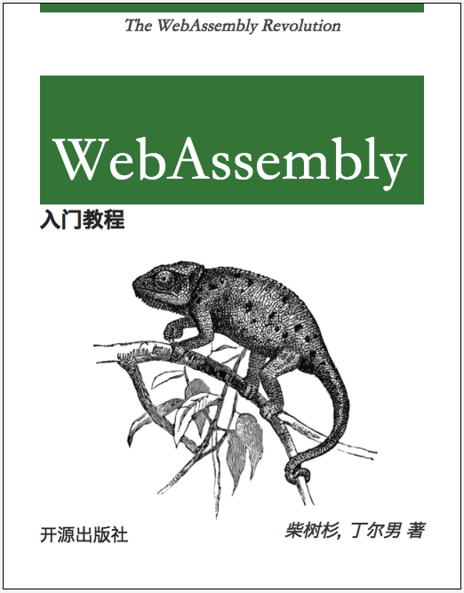

# WebAssembly标准入门

本书讲解了WebAssembly的基础知识，其内容涵盖了WASM的历史背景、WASM中汇编语言和虚拟机指令、浏览器对WASM的支持、其它高级语言对WASM的支持等。本书适合想要掌握WebAssembly技术的用户学习。

- 作者：[柴树杉(chai2010)](https://github.com/chai2010)，[丁尔男(Ending)](https://github.com/3dgen)
- 出版年: 2018-11-30
- 页数: 200
- 定价: 49
- 装帧: 平装
- ISBN: 9787115500595
- 代码: https://github.com/chai2010/wasm-book-code

----

*Ending's law: "Any application that can be compiled to WebAssembly, will be compiled to WebAssembly eventually."*

*Ending定律也称为终结者定律，它是Ending在2016年Emscripten技术交流会上给出的断言：一切可编译为WebAssembly的，终将会被编译为WebAssembly。*

----

## 购买和评论

- 异步：[https://www.epubit.com/book/detail/40619](https://www.epubit.com/book/detail/40619)
- 豆瓣：[https://book.douban.com/subject/30396640/](https://book.douban.com/subject/30396640/)
- 京东：[https://item.jd.com/12499372.html](https://item.jd.com/12499372.html)
- 当当：[http://product.dangdang.com/26294126.html](http://product.dangdang.com/26294126.html)
- 亚马逊：[https://www.amazon.cn/dp/B07KZ3ZNT3](https://www.amazon.cn/dp/B07KZ3ZNT3)
- 互动出版网：[http://product.china-pub.com/8054658](http://product.china-pub.com/8054658)
- 文轩网：[http://item.winxuan.com/1201798392](http://item.winxuan.com/1201798392)
- 中国图书网：[http://www.bookschina.com/7980146.htm](http://www.bookschina.com/7980146.htm)
- 样章：[webassembly-primer.pdf](https://github.com/chai2010/awesome-wasm-zh/blob/master/webassembly-primer.pdf)

<!--
苏宁/孔夫子

-->

----

## 作者简介

- 柴树杉，Go语言和WebAssembly技术专家，著有《Go语言高级编程》等书。GitHub 账号为chai2010。

- 丁尔男，Go语言爱好者，WebAssembly技术专家， 常年从事三维渲染引擎开发， 著有《C/C++面向WebAssembly编程》等书，现任武汉航天远景科技股份有限公司应用技术总监。GitHub 账号为3dgen。

----

## 内容简介

作为一种新颖的网页前端技术，WebAssembly的发展日新月异。本书基于已受浏览器普遍支持的WebAssembly极小可用特征集，致力于通过简单易懂的方式，从使用方法到虚拟机设计，讲解WebAssembly的运行原理。极小可用特征集只是快速迭代的起点，SIMD、多线程等更多特性将逐渐被添加到WebAssembly标准中。

在WebAssembly 大潮来临之际，希望本书能为该技术在国内的推广贡献绵薄之力。

本书内容要点：

- WebAssembly 简要介绍；
- 在JavaScript 中使用WebAssembly 模块的方法；
- WebAssembly 汇编语言及二进制格式；
- 使用高级语言开发WebAssembly 模块；
- WebAssembly 指令参考。

----

## 序言

某一天，有朋友向我推荐了一项新技术——WebAssembly。我认为这是一项值得关注的技术。

说WebAssembly是一门编程语言，但它更像一个编译器。实际上它是一个虚拟机，包含了一门低级汇编语言和对应的虚拟机体系结构，而WebAssembly这个名字从字面理解就说明了一切——Web的汇编语言。它的优点是文件小、加载快、执行效率非常高，可以实现更复杂的逻辑。

其实，我觉得出现这样的技术并不令人意外，而只是顺应了潮流，App的封闭系统必然会被新一代Web OS取代。但现有的Web开发技术，如JavaScript，前端执行效率和解决各种复杂问题的能力还不足，而WebAssembly的编译执行功能恰恰能弥补这些不足。WebAssembly标准是在谋智（Mozilla）、谷歌（Google）、微软（Microsoft）、苹果（Apple）等各大厂商的大力推进下诞生的，目前包括Chrome、Firefox、Safari、Opera、Edge在内的大部分主流浏览器均已支持WebAssembly。这使得WebAssembly前景非常好。

WebAssembly是Web前端技术，具有很强的可移植性，技术的潜在受益者不局限于传统的前端开发人员，随着技术的推进，越来越多的其他语言的开发者也将从中受益。如果开发者愿意，他们可以使用C/C++、Go、Rust、Kotlin、C#等开发语言来写代码，然后编译为WebAssembly，并在Web上执行，这是不是很酷？它能让我们很容易将用其他编程语言编写的程序移植到Web上，对于企业级应用和工业级应用都是巨大利好。

WebAssembly的应用场景也相当丰富，如Google Earth，2017年10月Google Earth开始在Firefox上运行，其中的关键就是使用了WebAssembly；再如网页游戏，WebAssembly能让HTML5游戏引擎速度大幅提高，国内一家公司使用WebAssembly后引擎效率提高了300%。

WebAssembly作为一种新兴的技术，为开发者提供了一种崭新的思路和工作方式，未来是很有可能大放光彩的，不过目前其相关的资料和社区还不够丰富，尽管已经有一些社区开始出现了相关技术文章，CSDN上也有较多的文章，但像本书这样全面系统地介绍WebAssembly技术的还不多，甚至没有。本书的两位作者都是有10多年经验的一线开发者，他们从WebAssembly概念诞生之初就开始密切关注该技术的发展，其中柴树杉是Emscripten（WebAssembly的技术前身之一）的首批实践者，丁尔男是国内首批工程化使用WebAssembly的开发者。

2018年7月，WebAssembly社区工作组发布了WebAssembly 1.0标准。现在，我在第一时间就向国内开发者介绍和推荐本书，是希望开发者能迅速地了解和学习新技术，探索新技术的价值。

*——蒋涛 CSDN创始人、总裁，极客帮创始合伙人*

----

## 目录

- 第0章　WebAssembly诞生背景 1
  - 0.1 JavaScript简史 1
  - 0.2 asm.js的尝试 2
  - 0.3 WebAssembly的救赎 5
- 第1章　JavaScript语言基础 7
  - 1.1 console对象 7
  - 1.2 函数和闭包 9
  - 1.3 Promise对象 12
  - 1.4 二进制数组 13
- 第2章　WebAssembly快速入门 17
  - 2.1 准备工作 17
  - 2.2 首个例程 21
  - 2.3 WebAssembly概览 22
  - 2.4 你好，WebAssembly 25
  - 2.5 WebAssembly调试及代码编辑环境 28
- 第3章　JavaScript中的WebAssembly对象 31
  - 3.1 WebAssembly对象简介 31
  - 3.2 全局方法 32
  - 3.3 WebAssembly.Module对象 36
  - 3.4 WebAssembly.Instance对象 41
  - 3.5 WebAssembly.Memory对象 44
  - 3.6 WebAssembly.Table对象 50
  - 3.7 小结及错误类型 61
- 第4章　WebAssembly汇编语言 65
  - 4.1 S-表达式 65
  - 4.2 数据类型 66
  - 4.3 函数定义 67
  - 4.4 变量 69
  - 4.5 栈式虚拟机 72
  - 4.6 函数调用 75
  - 4.7 内存读写 79
  - 4.8 控制流 83
  - 4.9 导入和导出 91
  - 4.10 start()函数及指令折叠 96
- 第5章　WebAssembly二进制格式 99
  - 5.1 LEB128编码 99
  - 5.2 头部和段数据 101
  - 5.3 内存段和数据段 104
  - 5.4 表格段和元素段 106
  - 5.5 开始段和函数索引 108
  - 5.6 全局段 111
  - 5.7 函数段、代码段和类型段 113
  - 5.8 导入段和导出段 118
  - 5.9 自定义段 121
  - 5.10 补充说明 126
- 第6章　Emscripten和WebAssembly 127
  - 6.1 安装环境 127
  - 6.2 你好，Emscripten！ 129
  - 6.3 C/C++内联JavaScript代码 133
  - 6.4 C/C++调用JavaScript函数 139
  - 6.5 JavaScript调用C导出函数 149
  - 6.6 运行时和消息循环 155
  - 6.7 补充说明 162
- 第7章　Go语言和WebAssembly 163
  - 7.1 你好，Go语言 163
  - 7.2 浏览器中的Go语言 166
  - 7.3 使用JavaScript函数 168
  - 7.4 回调Go函数 170
  - 7.5 syscall/js包 172
  - 7.6 WebAssembly模块的导入函数 175
  - 7.7 WebAssembly虚拟机 178
  - 7.8 补充说明 180
- 附录　指令参考 181
